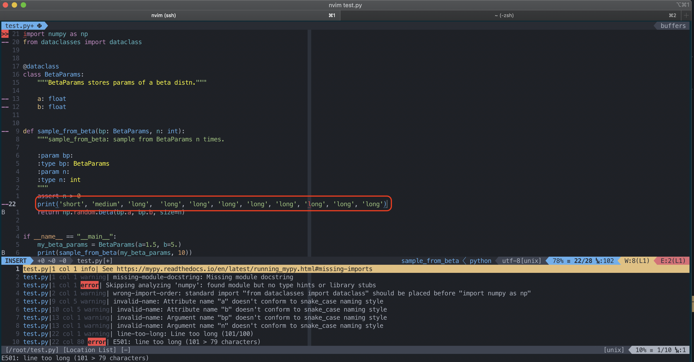
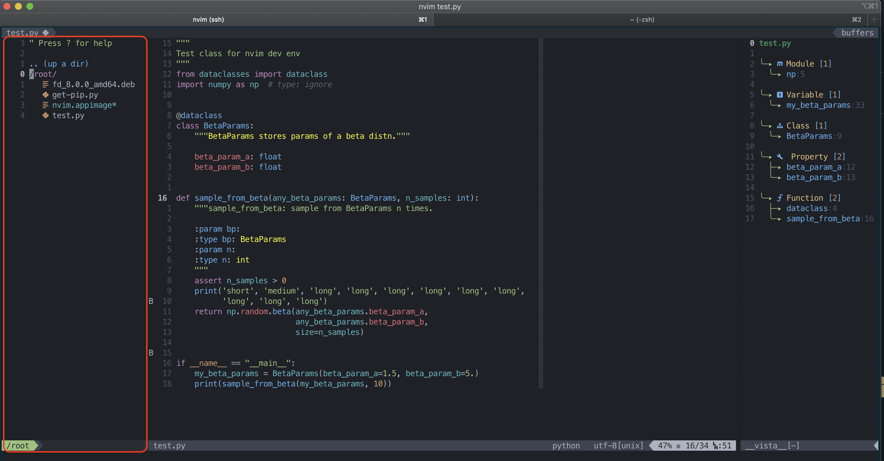

# nvim-python

Dockerized dev environment using neovim and language server protocol.

- [x] LSP provider [pyls](https://github.com/palantir/python-language-server)
- [x] Fast completion using [HansPinckaers' speed hacks](https://gist.github.com/HansPinckaers/f2a0382fa822aef83976b3e09eff1c46)
- [x] View documentation on hover or documentation as separate vim buffer
- [x] Documentation template generation by pydocstring (using [`doq`](https://github.com/heavenshell/py-doq)) - `numpy` format default
- [x] Debugger support for python: run/debug python code within nvim
    - [x] Toggle breakpoints
    - [x] step into, step over
    - [x] virtual text updates values of variables in comments
- [x] [Treesitter](https://github.com/nvim-treesitter/nvim-treesitter) based 
    - [x] semantic highlighting
    - [x] code folding
    - [x] smart rename
- [x] Linting: various providers incl. [pylint](https://www.pylint.org/), flake8, mccabe (code complexity), mypy (typing)
- [x] Various deep learning packages
- [x] [Rope](https://github.com/python-rope/rope/) based python code refactoring via Jedi: quick rename
- [x] Various convenience plugins 
    - [x] Fast motion using [easymotion](https://github.com/easymotion/vim-easymotion)
    - [x] Fuzzy list searching using [fzf](https://github.com/junegunn/fzf)
    - [x] tags support for searching 
    - [x] See tree of changes [undotree](https://github.com/mbbill/undotree)
    - [x] Directory browser using [nerdtree](https://github.com/preservim/nerdtree)
    - [x] Code outline using [Vista](https://github.com/liuchengxu/vista.vim)
- [x] Disabled by default: Multiple choices for completions (Jedi, ALE)
- [ ] Rope based python code refactoring: extract methods, variables, constants
- [ ] Tabnine based completions
- [ ] Multi-select
- [ ] Snippets

## Build:
```
git clone <this repo>
cd <this repo>
docker build -t  .
docker run -ti --rm 
```

## Launch 
Launch neovim using `nvim`

(Optional) Install plugins: `:PlugInstall` inside `nvim`

## TMUX
Does not seem to work well with TMUX currently --- TODO

## Keybindings
TODO

## Colorscheme
TODO

## Screenshots
By default, `<leader>` is `\` (e.g., `<leader>k` is `\k`)

Completion: 


Signature help while filling in function args:


Documentation on hover: Press `K`


Documentation in a buffer: Press `<leader>k`


Rename variable: `<leader>rn` when cursor on variable (`a_bp` in this example)


Add docstring template: `<leader>-` for current line


Code fixing: long line corrected by `yapf`




Ignore type error in import using `# type: ignore` annotation


Linter catches poor naming convention:


Code outline press `<leader>t`


Directory browser `<leader>e`



Toggle breakpoint: `<leader>db` for current line 
Start debug: `<leader>dc` and press `1`


Debugger stops are breakpoints (and exceptions/errors usually): (Note comments show values of vars)


`Continue` debugged with `<leader>dc` (Note comments show values of vars)


Open REPL if you want to interact with debugger using `<leader>dro`


Switch to the new REPL split per usual, enter insert mode to use it:


Hit continue again to finish the run `<leader>dc` - see terminal split (bottom most split) has the output


Close REPL and terminal splits


Debugger keymaps in `init.vim`:


Jedi keymaps in `init.vim` (and defaults):


Mappings for FZF: `<leader>o` to find by filename and `<leader>f` to find by tag:


Easymotion trigger is `s` followed by one character


More util mappings: Search buffers: `<leader>bu`; undo tree `<leader>u`


